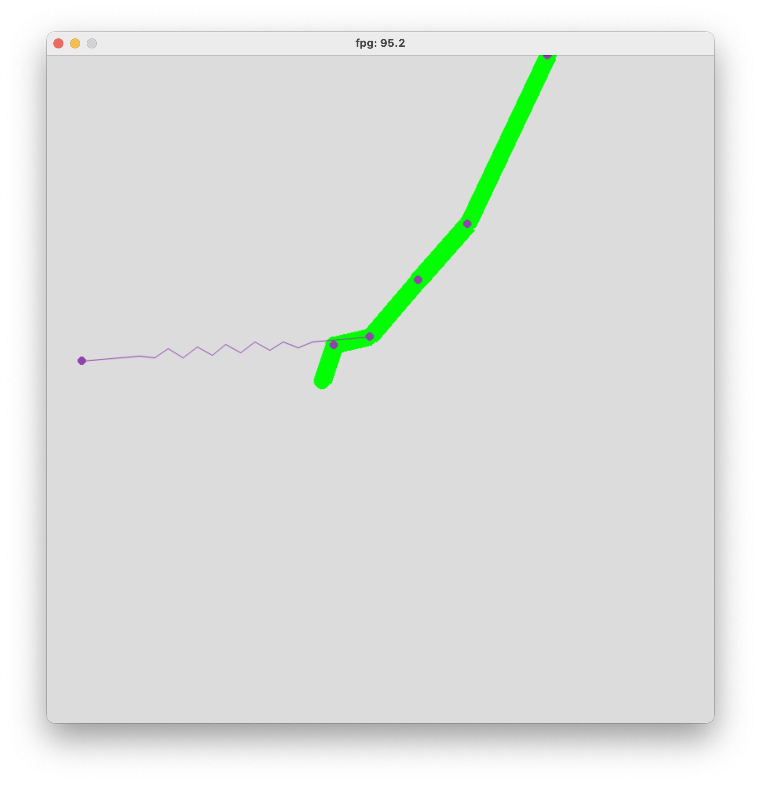

# Simulations
## Basics
This folder includes codes used to produce a visual simulation of hanging discrete catenaries.  
To run the simulation, please run `app.py`. The `Try outs` folder includes codes used as trials/explorations/demos during development and is not part of the final deliverable.  
## Getting started with the simulation
To ensure this simulation run properly on your machine, please install `PyMunk` and `PyGame`.  
The following are links to know more about this two libraries.  
[PyMunk](https://www.pymunk.org/en/latest/).  
[PyGame](https://www.pygame.org/wiki/GettingStarted).   
As for now, users only need to run the `app.py` file as the program is not taking any input. Users may use their cursor to click on the free end of the chain and remain mouse down to apply a force on the free end of the chain. This process may require some patience because the selecting process is not accurate enough.
## More about the program
The simulation is built on two Python libraries `PyMunk` and `PyGame`.  
The first iteration of the simulation simulates the scenario with a two-piece discrete link with one end hanging to the ceiling and the other end being draggble by the cursor. This program is hard-coded for now.  
We are developing a new version of simulation that simulates a discrete chain with both ends hanged to the ceiling. This version will take number of discrete components of the chain as input from the user and generate a corresponding discrete chain.
## Demos

